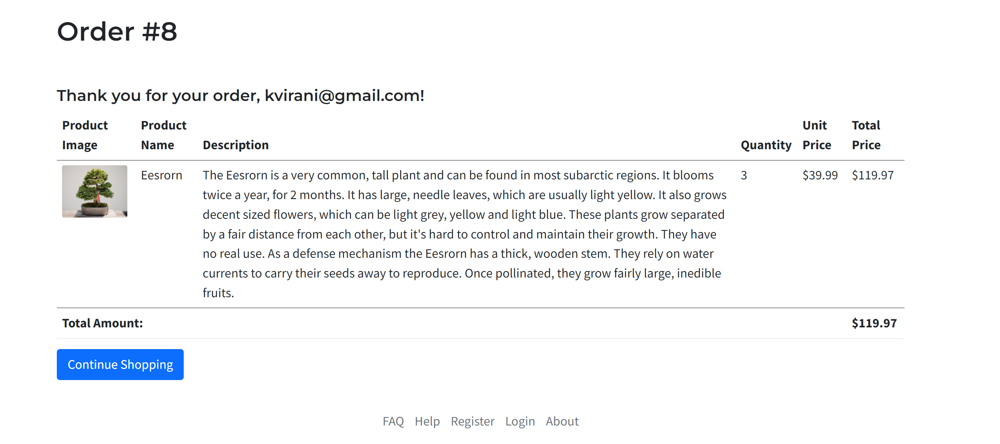

# My E-Commerce Store

Welcome to My E-Commerce Store! Built with Ruby on Rails, this application provides a seamless shopping experience, allowing users to explore products, manage their cart, and securely check out. Admin features offer a comprehensive system for managing products and categories.

## Screenshots!
[Product Page](app/assets/images/product_page.png)





## Features

### User Experience:
- **Products Display**: Products are showcased with images, names, and prices. Out-of-stock products are clearly marked with a "Sold Out" badge.
- **Shopping Cart**: Users can easily add products to their cart and view cart contents. The order details page provides an overview of items, quantities, and totals.
- **User Authentication**: Secure registration and login functionality. Users can sign up, log in, and log out with ease.
- **Guest Checkout**: Even without logging in, visitors can still place orders.

### Admin Capabilities:
- **Category Management**: Admins can create and manage product categories.
- **Product Management**: Admins can add, edit, or remove products associated with categories.
- **Admin Security**: Enhanced security measures protect admin functionalities, requiring additional authentication.

### Robust Error Handling:
- **Cart Validation**: Informative feedback when users try to check out with an empty cart.
- **Unique Email Validation**: Ensures users can't sign up with an existing email address.
- **Secure Password Storage**: Passwords are stored securely using bcrypt encryption. Passwords must be at least 8 chracters long.

## Getting Started

1. Clone the repository:
   ```bash
   git clone https://github.com/steven-serruya/jungle-rails

2. Navigate into the project directory:

cd jungle-rails

3. Install dependencies:
bundle install


4. Set up the database:
rails db:migrate

5. Start the Rails server:
bin/rails s -b 0.0.0.0

6. Visit http://localhost:3000 in your browser to explore the application.

## Testing
Run tests to ensure application stability:
bin/rspec


Stripe Testing
Use Credit Card # 4111 1111 1111 1111 for testing success scenarios.
